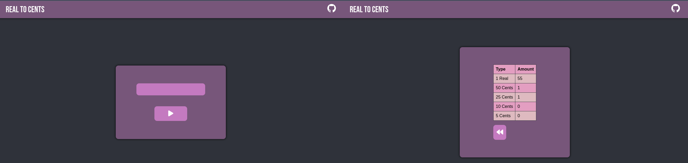

# RealToCents

This is the project that I developed based on repository [App-Ideas](https://github.com/florinpop17/app-ideas). 

**Tier:** 1-Beginner

Converting dollars to cents would enable you to practice your fundamental knowledge of programming. Loops, if conditions and a simple algorithm will be used.
Your task is to let the user input a dollar value (float), assuming that it can also accept extra cents (ex. $2.75), and convert it into an integer (in this case, if $2.75 = 275). After this, convert into coins with the sub-type of dollars: penny, nickel, dime and quarter. Use an algorithm that would divide the dollar value to the four coin types, and output few coins as possible.

The challenge: Try this without using any frameworks.

(EX. If you have $0.58, I would have 4 coins: 2 quarters, 0 dimes, 1 nickel and 3 pennies)

## User Stories

-   [x] User can enter a dollar value
-   [x] User can see the total cents from the converted dollar value
